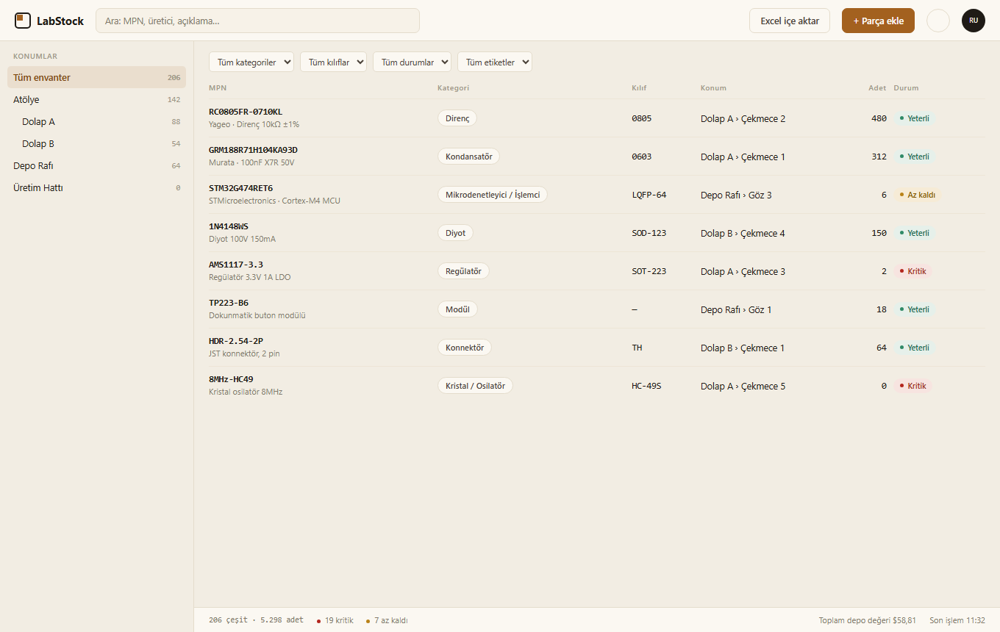
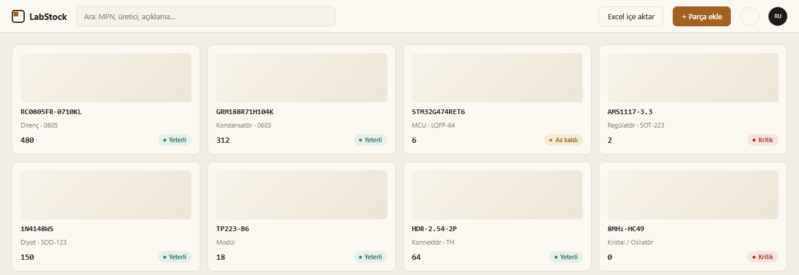
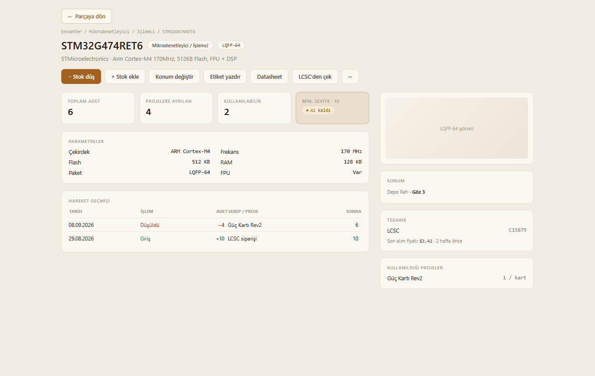
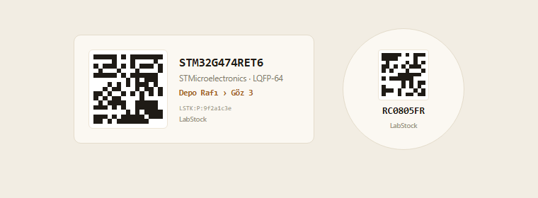
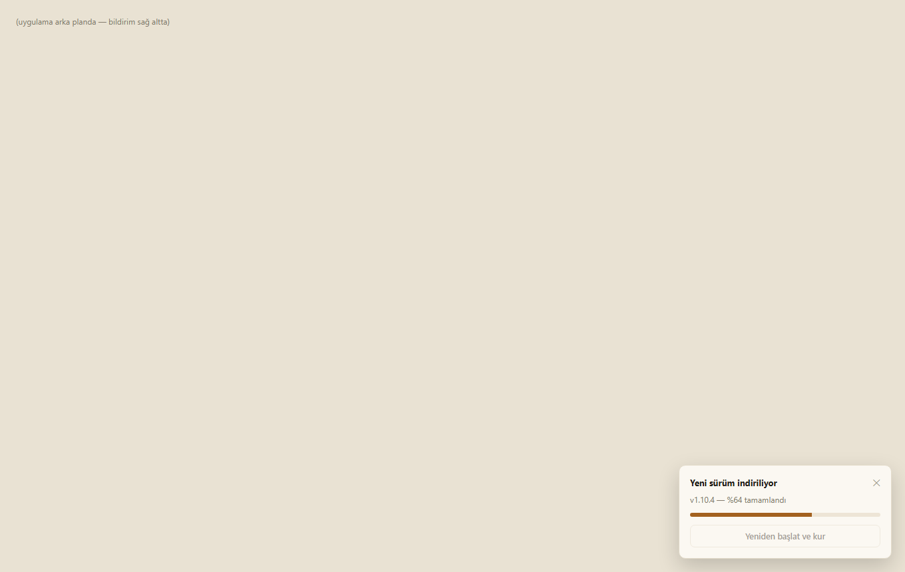
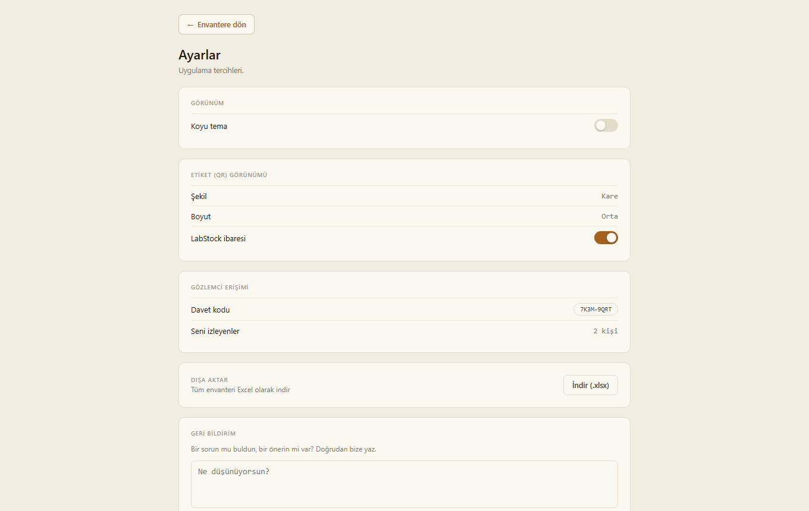

<p align="center">
  
</p>

<p align="center">
  Elektronik komponent deposu için stok takip uygulaması — Windows masaüstünde
  çalışır, kendini otomatik günceller, ekibinle paylaşabilirsin.
</p>

<p align="center">
  <a href="https://github.com/recepuysal/labstock/releases/latest">
    <strong>⬇ En son sürümü indir</strong>
  </a>
  ·
  <a href="#geri-bildirim--iletişim">Geri bildirim gönder</a>
  ·
  <a href="#lisans">Lisans</a>
</p>

---

<p align="center">
  
</p>

## Neden LabStock?

Elektronik hobisiyle uğraşan ya da küçük bir üretim atölyesi işleten herkes aynı
soruyu sorar: *"O direnç hangi çekmecedeydi?"* LabStock, parçalarını fiziksel
konumlarıyla (oda › dolap › çekmece › bölme) eşleştirip arama, filtreleme,
Excel'den toplu aktarma ve QR etiketleriyle bunu çözüyor — üstelik masaüstünde
her açılışta kendini sessizce günceller, kurulumdan sonra elle bir şey yapmana
gerek kalmaz.

## Özellikler

**Konum ağacı ve parça listesi**
Oda › dolap › çekmece › bölme şeklinde hiyerarşik bir konum ağacı; parça
listesini konuma, kategoriye, kılıfa, duruma ve etikete göre filtrele, liste ya
da ızgara görünümünde incele.

<p align="center">
  
</p>

**Parça detayı**
MPN, üretici, parametreler, hareket geçmişi, konum haritası, tedarik bilgisi ve
hangi projelerde kullanıldığı — tek sayfada. LCSC kodunu yapıştırıp "çek"
dediğinde üretici/açıklama/kategori/görsel otomatik doldurulur.

<p align="center">
  
</p>

**Yazdırılabilir QR etiketler**
Her parça ve konum için tamamen çevrimdışı üretilen QR etiketler — yazdır, kes,
çekmeceye yapıştır. Bir USB barkod okuyucuyla (ya da arama kutusuna elle
yapıştırarak) taratınca doğrudan ilgili parçaya/konuma atlar.

<p align="center">
  
</p>

**Excel ile toplu aktarım**
Elindeki envanteri tek bir `.xlsx`/`.csv` dosyasıyla içe aktar; tüm depoyu
istediğin an `.xlsx` olarak dışa aktar.

**Gözlemci (salt-okunur paylaşım)**
Ayarlar'dan ürettiğin bir davet koduyla, deponu bir meslektaşınla ya da
öğrencinle salt-okunur paylaş — düzenleme/silme arayüzü onlar için otomatik
gizlenir, sen tek taraflı erişimi istediğin an kaldırabilirsin.

**Masaüstü uygulaması + otomatik güncelleme**
Windows'a kurulum sihirbazıyla kurulur (yönetici izni gerekmez), her açılışta
arka planda güncelleme kontrolü yapar; yeni sürüm varsa uygulama içi sessiz bir
bildirimle indirilip kurulur — hiçbir pencere açılmaz.

<p align="center">
  
</p>

**Ayarlar**
Koyu/açık tema, etiket (QR) görünüm tercihleri, sürüm bilgisi, gözlemci
yönetimi ve doğrudan uygulama içinden geri bildirim gönderme.

<p align="center">
  
</p>

## Kurulum (kullanıcı olarak)

1. [Releases](https://github.com/recepuysal/labstock/releases/latest) sayfasından
   `LabStock-Kurulum.exe` dosyasını indir.
2. Çalıştır, sihirbazı takip et (yönetici izni gerekmez, kendi kullanıcı klasörüne kurulur).
3. Kurulum bitince uygulama açılır. "Hesap oluştur" ile kendi deponu kurarsın —
   kayıt olunca e-postana 6 haneli bir doğrulama kodu gelir (10 dakika geçerli),
   kodu girip onaylayınca depon hazır olur.
4. Başka birinin deposunu (salt-okunur) izlemek istiyorsan, o kişinin Ayarlar
   sayfasından ürettiği **davet kodunu** kayıt ekranındaki "Davet kodu" alanına
   gir — ya da kayıt olduktan sonra Profil sayfasından da girebilirsin.

Uygulama her açılışta arka planda güncelleme kontrolü yapar. Yeni bir sürüm
varsa sağ altta uygulama içi bir bildirim çıkar (Windows penceresi değil) —
"İndir" dedikten sonra ilerleme çubuğunu görürsün, "Yeniden başlat ve kur"
dediğinde de hiçbir pencere açılmadan sessizce güncellenip kendini yeniden açar.

## Geri bildirim & iletişim

Bir hata mı buldun, bir özellik mi eksik? İki yolu var:

- Uygulama içinden: **Ayarlar → Geri Bildirim** kartından doğrudan yaz, gönder.
- E-posta: **labstockassistant@gmail.com**

## Lisans

LabStock ücretsizdir — kişisel ya da ticari amaçla kurup kullanabilirsin. Kaynak
kodu ya da değiştirilmiş bir sürümünü başkalarına dağıtamaz/yayınlayamazsın;
tek resmî dağıtım kanalı bu depodaki [Releases](https://github.com/recepuysal/labstock/releases)
sayfasıdır. Tam şartlar için [LICENSE](LICENSE) dosyasına bak.

---

## Geliştirme

Aşağısı katkıda bulunmak ya da projeyi kendi Supabase projenle çalıştırmak
isteyenler için.

### 1. Supabase projesi

1. [supabase.com](https://supabase.com) üzerinde yeni bir proje aç.
2. **SQL Editor**'ü aç, `supabase/migrations/0001_init.sql` dosyasının tamamını
   yapıştır ve çalıştır. (Şema, RLS politikaları, `stok_hareket()`/gözlemci
   RPC'leri, `envanter` view'ı ve `handle_new_user()` tetikleyicisi bir kerede kurulur.)
3. **Authentication → Sign In / Providers → Email**: geliştirme sırasında
   "Confirm email" kapalıysa (varsayılan) kayıt olur olmaz giriş yapabilirsin —
   e-posta doğrulama akışını denemek istersen adım 4'e bak.
4. **E-posta doğrulama (isteğe bağlı, üretimde önerilir)**: Supabase'in kendi
   mailer'ı saatte birkaç e-postayla sınırlı olduğundan gerçek kullanım için
   özel bir SMTP sağlayıcısı (ör. bir Gmail hesabının "Uygulama Şifresi" ile
   `smtp.gmail.com`, ya da Resend/SendGrid gibi bir servis — bunlar kendi alan
   adını doğrulamanı ister) gerekir:
   - **Authentication → Emails → SMTP Settings**'ten kendi bilgilerini gir.
   - **Authentication → Sign In / Providers → Email → Confirm email**'i aç.
   - **Authentication → Emails → Confirm signup** şablonunu `{{ .Token }}`
     değişkenini (6 haneli kod) gösterecek şekilde düzenle — link değil kod
     kullanıyoruz, çünkü masaüstü uygulamasında e-postadaki linke tıklamak
     harici bir tarayıcı açar ve oradan uygulamaya geri bildirim almak
     (custom protocol handler) gereksiz karmaşıklık yaratır.
   - Bu ayarlar `supabase/migrations/0001_init.sql` dosyasının dışında —
     proje bazlı, dashboard'dan (ya da Management API'den) yapılır.
5. **Project Settings → API** ekranından `Project URL` ve `anon public` anahtarını al.

### 2. Web tarafında çalıştırmak (tarayıcıda test için)

```bash
cp .env.example .env.local     # Windows: copy .env.example .env.local
# .env.local içine Supabase URL ve anon key'i yaz

npm install
npm run dev
```

`http://localhost:3000` → `/kayit` ile hesap aç.

### 3. Masaüstü uygulaması olarak paketlemek

```bash
npm run build:desktop          # Next.js'i standalone build'e alır
cd electron-app
npm install
npx electron-builder --win     # electron-app/dist/LabStock-Kurulum.exe üretir
```

`electron-app/main.js` uygulama açılışında bu standalone sunucuyu arka planda
(görünmez) başlatır, hazır olduğunda bir Electron penceresinde açar.

### 4. Yeni bir sürüm yayınlamak

1. `electron-app/package.json`'daki `version`'ı artır (ör. `1.6.0` → `1.6.1`).
2. `git commit`, sonra `git tag v1.6.1` ve `git push origin master v1.6.1`.
3. `.github/workflows/build-desktop.yml` GitHub'ın kendi sunucusunda otomatik
   derler, imzalar ve `.exe` + `latest.yml`'i bir GitHub Release'e ekler.
4. Kurulu olan uygulamalar bir sonraki açılışlarında bunu fark edip güncellenir.

`.github/workflows/keep-alive.yml` ayrıca haftada iki kez Supabase projesine
hafif bir istek atar — ücretsiz plandaki projeler 7 gün hiç istek almazsa
otomatik duraklatıldığı için bunu önler.

## Veri modeli

Kritik tasarım kararı: **parça tanımı ile stok ayrı**.

| Tablo | Ne tutar |
| --- | --- |
| `parts` | Ortak katalog — MPN, üretici, kategori, kılıf, datasheet, parametreler. Kullanıcıdan bağımsız; herkes ekledikçe büyür. |
| `locations` | Kullanıcıya ait hiyerarşik konum ağacı (oda › dolap › çekmece › bölme), her düğümde bir `tip`. |
| `stock_items` | Kullanıcının elindeki stok: parça × konum, adet, min. seviye, tedarikçi, alış fiyatı. |
| `stock_movements` | Hareket defteri — her +/- işlem, sebebi ve sonraki adet. |
| `projects`, `project_bom` | Proje ve malzeme listesi. Parça detay sayfasından ekleniyor; ayrı bir Projeler sayfası henüz yok. |
| `tags`, `stock_item_tags` | Kullanıcıya özel serbest etiketler; bir stok kalemine birden fazla etiket iliştirilebilir. |
| `profiles` | Ad/telefon/şirket bilgisi, profil fotoğrafı, tema tercihi ve gözlemcilik alanları (`davet_kodu`, `gozlemci_of`, `gozlemci_baglandi`, `son_gorulme`). |
| `feedback` | Ayarlar sayfasındaki geri bildirim formundan gelen mesajlar. |

Adet doğrudan yazılmaz: `stok_hareket()` RPC'si `stock_items.adet` güncellemesi ile
hareket kaydını birlikte yapar.

### Çok kullanıcılı izolasyon

Her kullanıcı tablosunda `user_id = auth.uid()` RLS politikası var; izolasyon
uygulama katmanında değil **veritabanı seviyesinde**. `envanter` view'ı
`security_invoker = true` ile tanımlı, yani view bir yetki kaçağı oluşturmaz.
`parts` ortak katalog olduğu için herkes okur; sadece ekleyen düzenler.

### Gözlemci (salt-okunur izleyici) rolü

Bir hesap, Ayarlar sayfasından ürettiği **davet kodunu** paylaşarak başkalarının
kendi deposunu salt-okunur izlemesine izin verebilir:

- Davet kodu girildiğinde `gozlemci_baglan()` RPC'si (ya da kayıt sırasında
  `handle_new_user()` tetikleyicisi) `profiles.gozlemci_of` alanını sahibin
  `user_id`'sine bağlar. Bir sahibin izleyen sayısı **8 ile sınırlı**.
- Her tabloya, mevcut "kendi verin" RLS politikasına dokunmadan ek bir
  **salt-okunur SELECT** politikası eklenmiş durumda (`*_gozlemci_read`) —
  Postgres'te aynı komut için birden fazla politika OR'lanır.
- Bir gözlemci kendi deposunu da kullanabilir: hangi deponun aktif olduğu
  (`aktifGorunumAl()`, `src/lib/gozlemci.ts`) bir cookie ile tutulur, tüm
  sorgular buna göre açıkça filtrelenir — RLS'e tek başına güvenmek, sahiplik
  ve izleme politikaları aynı anda aktifken iki deponun karışmasına yol açar.
- Üst bardaki geçiş kontrolü ile "Benim deposu" / "İzlediğim depo" arasında
  değişilir; izleme modunda tüm düzenleme/silme arayüzü gizlenir.

## Şu an ne var

- E-posta + şifre ile kayıt/giriş, "beni hatırla", 6 haneli kodla e-posta doğrulama
- Konum ağacı: alt ağaca göre filtreleme, adet rozetleri, aç/kapa, bölme haritası, düzenle/sil
- Parça listesi: arama, kategori/kılıf/durum/etiket filtreleri, sıralama, liste/ızgara görünümü
- Parça detay sayfası: parametreler, hareket geçmişi, konum haritası, tedarik bilgisi,
  kullanıldığı projeler, serbest etiketler, RoHS rozeti, parça görseli
- Yazdırılabilir QR etiketler (tek parça + toplu konum), USB barkod okuyucu desteği
- Excel/CSV toplu içe aktarma; Ayarlar'dan tüm envanteri `.xlsx` olarak dışa aktarma
- Son Aktiviteler: depodaki tüm stok hareketlerinin tek sayfada listesi
- Ayarlar: koyu/açık tema, etiket (QR) görünüm ayarları, sürüm bilgisi ve güncelleme
  kontrolü, gözlemci davet kodu yönetimi, uygulama içi geri bildirim formu
- Profil: kişisel/şirket bilgileri, profil fotoğrafı/şirket logosu yükleme, gözlemcilik bağlantısı
- Gözlemci rolü: davet koduyla salt-okunur depo paylaşımı, sahip tarafından tek taraflı çıkarma
- Windows masaüstü uygulaması: Electron ile paketleme, GitHub Releases üzerinden
  sessiz otomatik güncelleme, Supabase projesini uyanık tutan zamanlanmış ping

## Sırada

- Çoklu tedarikçi fiyat karşılaştırması (`part_suppliers` şeması hazır, arayüzü yok)
- Ayrı bir Projeler sayfası: bir projeyi üretmek için eksik parça hesaplama
- Sistem tepsisi simgesi, Windows açılışında otomatik başlatma
- Düşük stok için bildirim

## Notlar

- Fontlar `<link>` ile Google Fonts'tan geliyor (`src/app/layout.tsx`). Ağı kısıtlı
  bir ortamda build alacaksan `next/font` yerine bu yöntem kırılmaz.
- Arayüz teması `src/app/globals.css` içindeki CSS değişkenlerinde: PCB fiberglas
  krem zemin, bakır `#A3611F` aksan, Space Grotesk + JetBrains Mono; koyu tema
  `[data-theme='koyu']` altında ayrı bir token seti olarak tanımlı.
- `labstock-a1-logo/` klasöründe logo setinin kaynak SVG/PNG'leri ve kullanım
  kuralları (`LOGO.md`) var; doğrulama e-postasındaki logo da buradan (GitHub'ın
  ham dosya URL'i üzerinden) çekiliyor.
